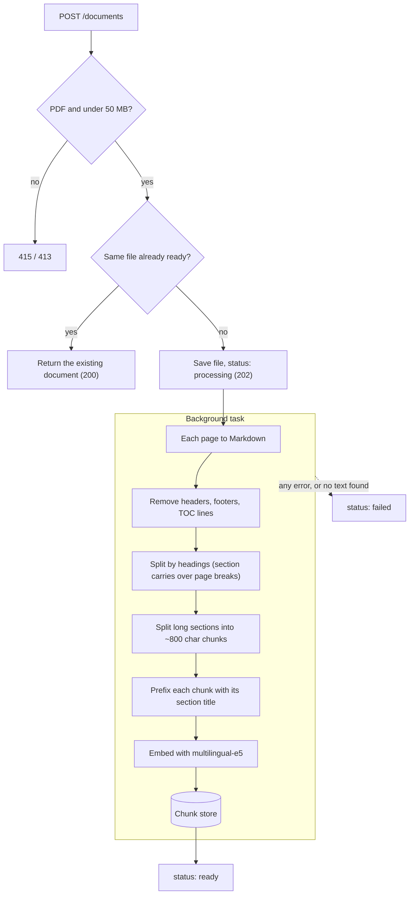
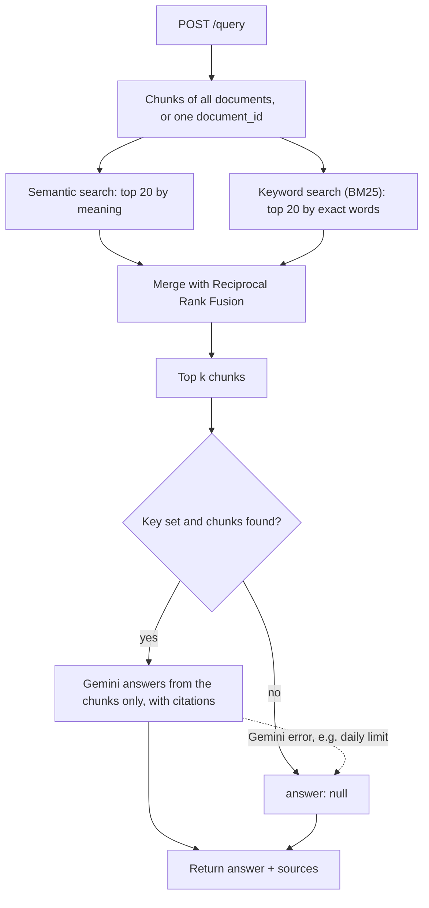
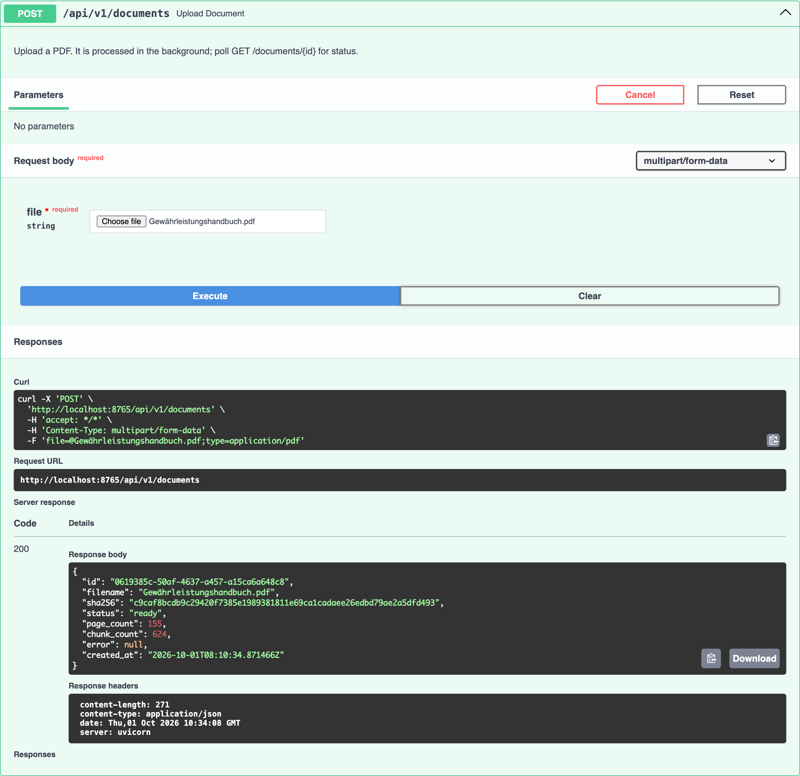
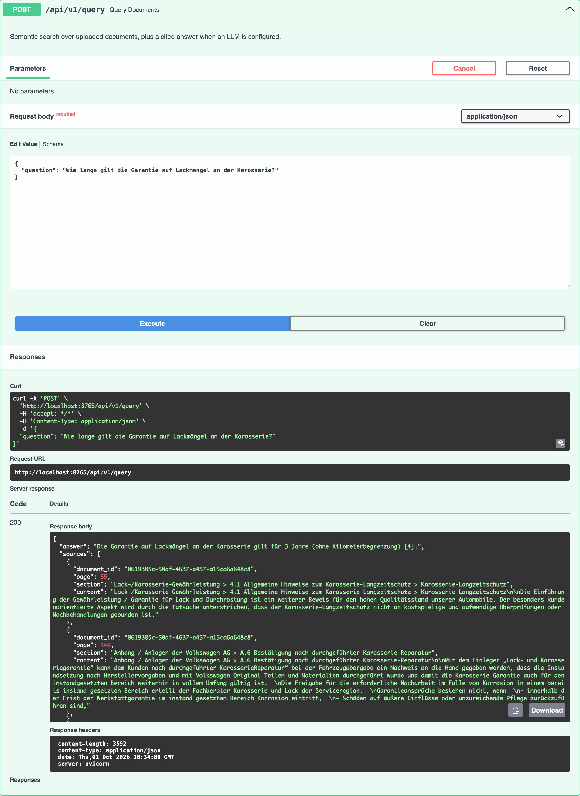
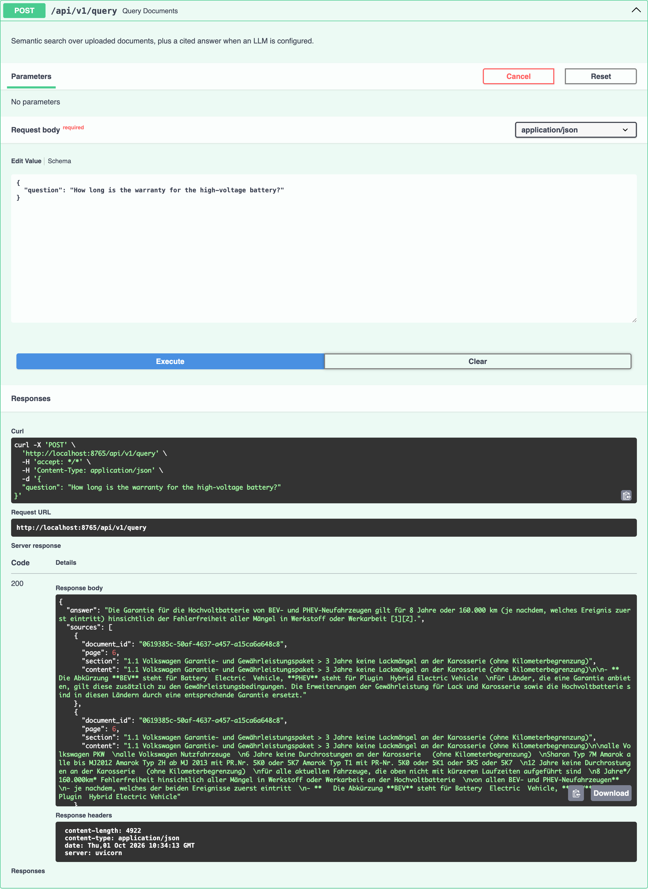

# PDF RAG Pipeline

Upload PDF documents and ask questions about them in plain language.
You get the most relevant passages back, plus a short answer with citations if a Gemini API key is set.

Built with FastAPI, Pydantic and LangChain. Everything runs locally.

### Uploading a PDF




### Asking a question




## Quickstart

You need [uv](https://docs.astral.sh/uv/). It installs Python 3.13 for you.

```bash
uv sync
cp .env.example .env      # optional: add GOOGLE_API_KEY for generated answers
uv run fastapi dev
```

Open [http://127.0.0.1:8000/docs](http://127.0.0.1:8000/docs) to try it in the browser.

> The first start downloads the embedding model (about 1.1 GB), so it takes a few minutes.
> After that it starts in seconds.


## Demo

Uploading the handbook. It was already indexed, so the existing document comes back right away:



A German question. The answer cites source `[4]`, page 6 of the handbook:



An English question about the German document:




## Evaluation

`eval/questions.json` has 13 questions about the handbook: facts, processes, exact codes, English questions and one question the handbook can't answer.

```bash
uv run python -m eval.run_eval      # expects Gewährleistungshandbuch.pdf in the project root
```


| Metric                    | Result        |
| ------------------------- | ------------- |
| Correct page in the top 5 | 12 of 12      |
| MRR                       | 0.78          |
| Search latency            | ~50 ms median |


With an API key, the script also prints each answer and its token usage.

## Tests

```bash
uv run pytest
```

The tests run the real pipeline on small generated PDFs. Only the embedding model and the LLM are replaced, so they finish in about 2 seconds.

## Project layout

```
app/
  api/         routes and dependencies
  schemas/     Pydantic models
  services/    ingestion and query logic
  stores/      document and chunk storage (JSON files in data/)
  rag/         PDF loading, chunking, embeddings, answer generation
  core/        settings and logging
eval/          retrieval evaluation
tests/
```


## Limitations

This was built for a 60-minute task, so I kept it simple on purpose:

- Data lives in memory and in JSON files under `data/`. Run a single server process.
- If the server restarts while a PDF is processing, upload it again.
- No OCR, so text inside images is not searchable.
- If Gemini fails or hits its daily limit, the API skips the answer, logs it, and still returns the sources.


## Making it production-ready

1. **Event-driven ingestion.** An upload publishes an event, and workers parse, chunk and embed the document. This scales on its own and survives restarts.
2. **A real vector store.** OpenSearch at scale, or PostgreSQL with pgvector while the volume is small. Both also give proper full-text search.
3. **Guardrails.** Check questions and answers, refuse anything outside the documents' scope with a denial gate, and scrub personal data (PII) before it reaches the LLM or the logs.
4. **Docker.** Package the API and workers as containers, so they are easy to run and deploy.


## A note on transparency

I wrote this with [Claude Code](https://claude.com/claude-code), the coding assistant I use every day at work. The design and decisions are mine; Claude Code helped me turn them into code. I reviewed and committed every step myself